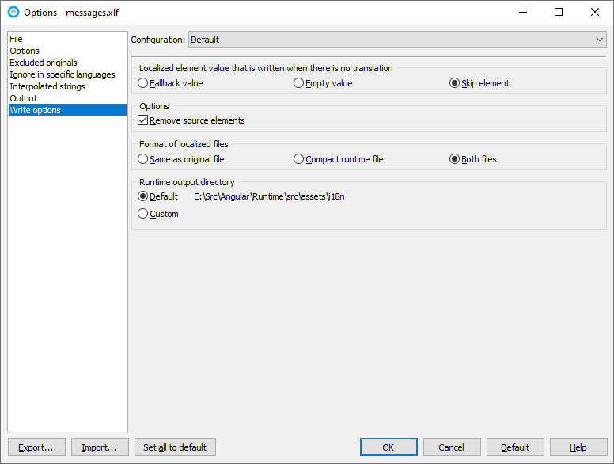

# Runtime Translation Loading for Angular

The standard Angular 9 internationalization (I18N) and localization (L10N) is designed to produce one compiled application per language. This is quite restrictive because you have to compile the language for each language and then deploy each compilation result to a separate URL. The standard Angular internationalization has the means to load translations on runtime, but the Angular team has not fully implemented that feature. This API fills that gap. It is important to notice that this API works on the top of the Angular internationalization API, not replacing it.

Start by installing the Soluling library.

```bash
npm install @soluling/angular
```

The first thing you need to modify in your application is to make sure that the translations are loaded before any module is created. The right place for that is `main.ts`. The default code to initialize the modules is:

```typescript
platformBrowserDynamic().bootstrapModule(AppModule)
  .catch(err => console.log(err));
```

Modify it as shown in the following code snippet.

```typescript
import { loadTranslations } from '@angular/localize';
import { getTranslations } from '@soluling/angular';
import '@angular/localize/init';
...
getTranslations('assets/i18n').then(translations => 
{
  if (translations)
    loadTranslations(translations);

  import('./app/app.module').then(module => 
  {
    platformBrowserDynamic()
      .bootstrapModule(module.AppModule)
      .catch(err => console.error(err));
  });      
});
```

Here we first call `getTranslations` function that gets the translation file from the server. The function gets the resource file matching the current language of the browser. You can override the language by using the parameters, but the default behavior is to find a resource file matching the language of the browser. If the function finds any translations, then it loads them using `loadTranslations`. If no translation is found, no loading happens, and then the application uses the original strings.

The resource files are simple JSON files that contain key-value pairs.

```json
{
  "1238358838717941284": "Sample",
  "3067469718492071419": "This is a sample"
}
```

The reason the library uses JSON instead of XLIFF or XMB is that on runtime, we need only the key and the value. Everything else is unnecessary. XLIFF and XMB are a lot more verbose formats that cause larger file sizes. Also, they use XML that means slower parsing. Using JSON keeps the resource size smaller and produces faster parsing time. The easiest way to create the runtime files is to use Soluling, but you can also create them yourself. The name of the resource file is `<id>.json` when `id` is IETF language tag (the same code passed in HTTP Accept-Language).

The next modification you need to do is to add locale support for the languages you plan to support. By default, Angular application contains support for English (United States). If you plan to support German and Japanese, you need to add the locale support for those languages. Add the following code into your `app.module.ts`.

```typescript
import { registerLocaleData } from '@angular/common';

import de from '@angular/common/locales/de'; 
import ja from '@angular/common/locales/ja'; 

registerLocaleData(de, 'de'); 
registerLocaleData(ja, 'ja'); 
```

The above code will ensure that the compiled application contains the locale date also for German and Japanese besides English. All locale-dependent functions, such as date pipe, rely on the locale data.

The final modification is to add a code that species the active locale of the application. Angular uses the `LOCALE_ID` variable for that. By default, it is `en-US`. Let's add code to change that to match to the locale id of the resource we have loaded.

```typescript
import { NgModule, LOCALE_ID } from '@angular/core';
import { LocaleService } from '@soluling/angular';
...
@NgModule({
  declarations: [
    AppComponent
  ],
  imports: [
    BrowserModule
  ],
  providers: [
    LocaleService, 
    { provide: LOCALE_ID, deps: [LocaleService], useFactory: (service: LocaleService) => service.localeId },
  ],
  bootstrap: [AppComponent]
})
export class AppModule { }
```

We use `LocaleService` service. It is a service that gives us the id of the loaded resource.

The final step is you place the runtime resource files into assets/i18n directory. Angular extract tool extracts the design time resource file (XLIFF or XMB). Even Soluling can localize both XLIFF 1.2, XLIFF 2.0 and XMB; you need to use XLIFF 2.0 when using the runtime localization. Add the XLIFF 2.0 created by the extract tool to a Soluling project. Then select the `.xlf` in the project tree and choose Options. Select Write options sheet. Check either *Compact runtime file*, or *Both files*.



By default Soluling creates the runtime files into assets\i18n directory that is the directory you want to have them. Run the application.

```bash
ng server -o
```

If you have the resource file matching your browser's language, the application appears in that language. If not, change the language of the browser and click refresh to see the application in the selected language.

**Note!** The extract tool of Angular 9 does not extract source code strings but only strings from templates. An improved extract tool will most likely arrive with Angular 9.1.

**Note!** At the moment, Soluling is a Windows application and works only on Windows. However, we plan to release a web-based version soon.